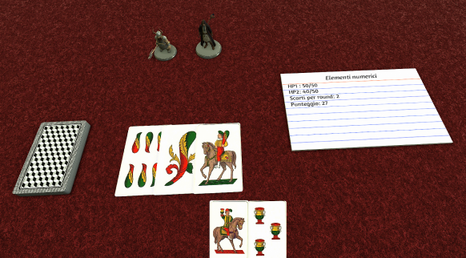
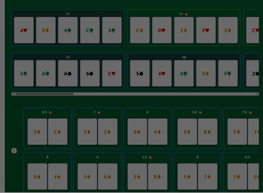

# Pre 10/6 - Idee Gameplay

# Idea 1

Base del 31

Una via di mezzo tra STS e Balatro
Possibilità di gameplay auto/manual
La briscola potrebbe attivare gli effetti del seme corrispondente
Eventuali “Joker” sono passive che permettono di modificare parametri di attacco/armor, scambio di semi, modificatori sul “giro” della briscola

# Idea 2

Autobattle con “doppio punteggio” 31 e 7 1/2
Si mostrano carte e si raccolgono a “cinquine” per calcolare il punteggio a 31, contemporaneamente si raccolgono per seme a coppie per calcolare il punteggio a 7 1/2

Una cosa interessante è che modificare il mazzo aggiungendo figure o spingendo su un seme potenzia il 31 ma depotenzia il 7 e mezzo, creando una asimmetria da approfondire

Possibilità di implemantare il gameplay contro altri mazzi o contro uno scopre/HP

# Idea 3

Si potrebbe pensare di creare dei “cicli”, dando modo di fare più punti (moltiplicatori) o semplicemente la cosa che ti “protegge” dal re.

Se ad esempio c’è una meccanica per la quale le carte non vengono mescolate a caso ma secondo dei pattern (es. shift di n posti)

Parti con 36 carte, quando comincia la partita si aggiungono i 4 re (modificabile), scelgo la prima carta e giro finchè non trovo il re.

Si potrebbe fondere autobattler e meccanica manuale facendo si che si scelga una sola carta fino a quando si trova un re o si gira una carta che è già al suo posto. A quel punto si può scegliere un’altra carta dalla quale partire.